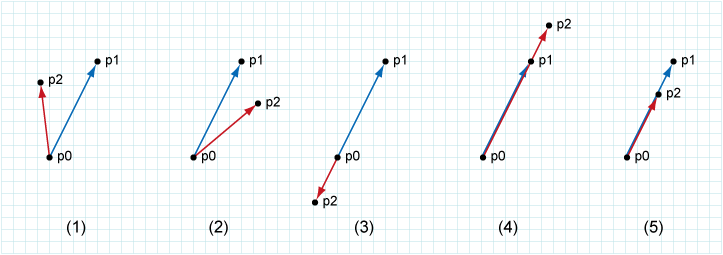

### CGL_1_C(判断三个点的位置关系)


```js
function ccw(p0, p1, p2) {
 // 逆时针方向
 const COUNTER_CLOCKWISE = 1
 // 顺时针
 const CLOCKWISE = 2
 // 完全相反
 const ONLINE_BACK = 3
 // 方向相同（p1较远）
 const ONLINE_FRONT = 4
 // 方向相同（p2较远）
 const ON_SEGMENT = 5

 let a = p1.clone().sub(p0)
 let b = p2.clone().sub(p1)

 if(a.clone().cross(b) > 0) {return COUNTER_CLOCKER}
 if(a.clone().cross(b) < 0) {return CLOCKER}
 if(a.dot(b) < 0) {return ONLINE_BACK}
 if(a.norm() < b.norm()) {return ONSEGMENT}
}
```
