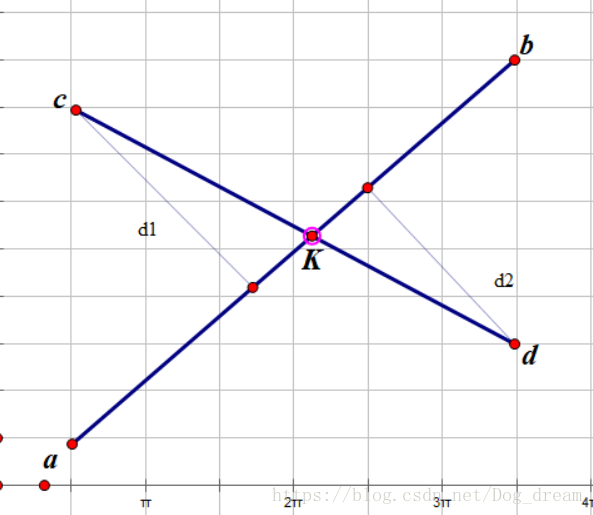

> 参考: https://blog.csdn.net/Dog_dream/article/details/83097078
### CGL_2_C(求线段交点)


**思路:**
- 根据点到直线的距离,求出: `d1`和`d2`
- 根据三角的相似性, $d1:d2=|cK|:|dK|$
- 设: $t=|ck|/|cd|, => K=a+cd*t$

求|ck|:
```math
cK/dK = s  \\
cK+dK = cd  \\
cK = s*dK \\
dK = cK/s \\
cK/s+cK = cd \\
ck(1+1/s) = cd \\
ck*(s+1)/s = cd \\
ck = cd*s/(s+1) \\
```

```js
/**
 * 计算两条线的交点,没有交点返回 null
 */
export function lineIntersec(a, b, c, d) {
    // todo:先判断有无交点
    let p1 = projection(c, a, b)
    let p2 = projection(d, a, b)
    let d1 = p1.distanceTo(c)
    let d2 = p2.distanceTo(d)
    let s = d1 / d2
    let cd = c.distanceTo(d)
    let ck = cd * s / (s + 1)
    let t = ck / cd

    let cdV = d.clone().sub(c)
    let k = cdV.multiplyScalar(t).add(c)
    console.error(t);
    return k
}
```
