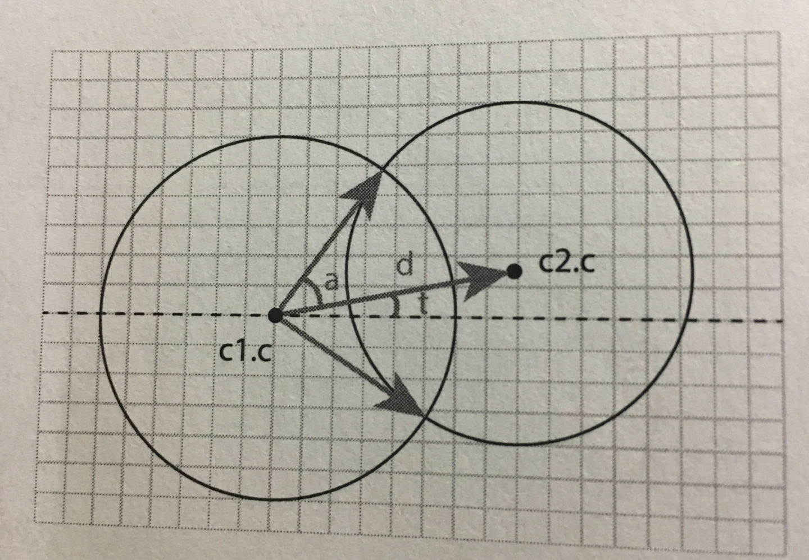

> https://blog.csdn.net/Mr_HCW/article/details/82861431


### CGL_7_E(圆和圆的交点)


**思路:**
- 一个交点和2个圆心组成的三角形三条边长已知
- 根据余弦定理可求出角度`a`的大小
- 最后所求的交点就是: 以圆心`c1.c`为起点, 大小为`c1.r`,角度为 `a` 和 `-a` 的两个向量


```js
/**
 * 计算两个圆的交点,只能计算xoy平面上的
 * todo: 加上圆的法线,支持三维交点检测
 * @param {*} c1
 * @param {*} r1
 * @param {*} c2
 * @param {*} r2
 */
export function circleAndCircleIntersec(c1, r1, c2, r2) {
    // 两个圆心的距离
    let c1c2 = c2.clone().sub(c1)
    if(c1c2.length > r1+r2) {
        return null
    }

    // 根据余弦定理
    let a = r2
    let b = r1
    let c = c1c2.length()
    let cosA = (b * b + c * c - a * a) / (2 * b * c)
    let A = Math.acos(cosA)

    let rotation = c1c2.clone().normalize().multiplyScalar(r1)
    let ret = []
    ret[0] = rotation.clone().applyAxisAngle(new THREE.Vector3(0,0,1), A).add(c1)
    ret[1] = rotation.clone().applyAxisAngle(new THREE.Vector3(0,0,1), -A).add(c1)
    return ret
}
```