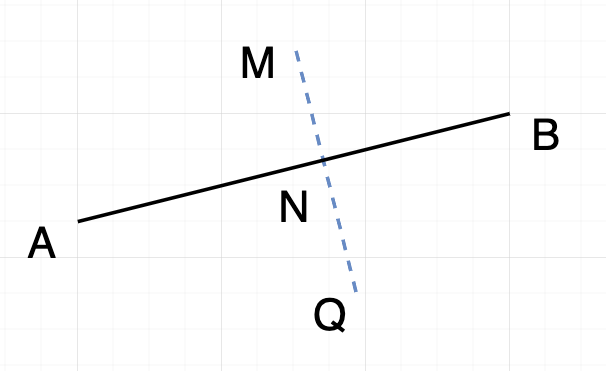

### 点在直线的镜像


**题意描述:** 已知线段AB和一点M,求其在直线的对称点Q.

**解:**
- 使用先前的问题`CGL_1_A`,可以求出点M在直线的投影点N。
- 所以, $Q = M + 2 \vec{MN}$

```js
function projection(point, line) {
  return point;
}

function reflection(point, line) {
  let p = projection()
  return line.start + line*2
}
```
