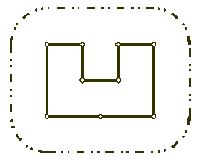
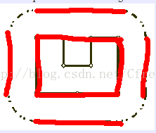
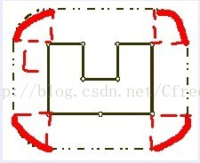

[POJ 1113 Wall【凸包周长】](https://blog.csdn.net/Cfreezhan/article/details/9530511)

### POJ-1113(凸包周长)

**题意:**
- 按照顺时针顺序给你N个点的坐标,再给你一个长度L
- N个点代表中间城堡的坐标
- 要求城堡任意一点到城墙的距离恰好L远建立城墙,求`外侧城墙`精确的长度

注意：结果四舍五入+0.5取整即可

**思路:**
凸包周长+以 L 为半径圆的周长.

