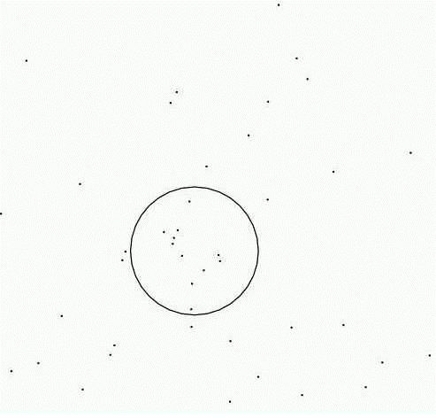
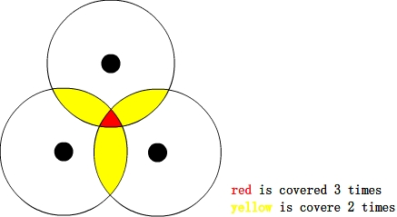
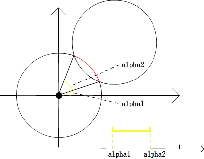
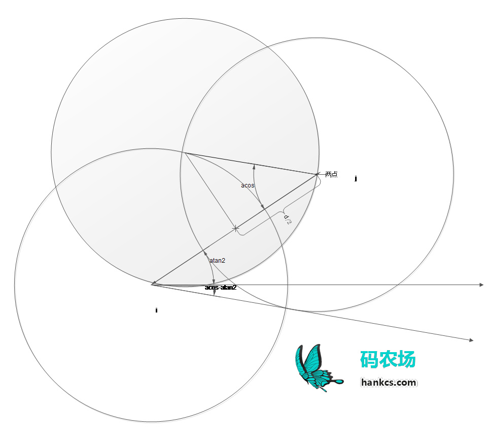

> https://www.acwing.com/solution/content/10936/

> https://sumygg.com/2013/08/06/Radius-Circle-Cover/

> http://www.hankcs.com/program/algorithm/poj-1981-circle-and-points.html

### POJ_1981(单位圆覆盖)
**问题:** 在点集里找到一个单位圆使包含的点最多

**思路:(n^2logn)**

- 以每个点为圆心，以半径R画圆，然后统计每个区域重叠的次数，记录最大.
- 那么最终圆的圆心放在覆盖区域最多的地方,覆盖的点就是最多的。
- 红色区域的表示，可以用围成区域的边界表示:圆弧。

- 那么问题归结于找出一个圆上被覆盖次数最多的一段弧。

**圆弧的表示:**
用两个极角表示，分别为起始和终止，类似于一个区间。枚举完其他点之后，得到N-1个区间。将其排序后，从前往后扫描，碰到起始计数+1，碰到终止计数-1，同时更新答案。

区域问题转化成了线段覆盖次数的问题了。然后就是把alpha1，alpha2映射到一个[0, 4pi]的区间，这里映射到[0, 4pi]而不是[0, 2pi]是由于alpha的范围是[-pi/2, 5pi/2]，而非[0, 2pi]，对于不在[0,4pi]范围内的点，直接加2pi不会影响结果。
