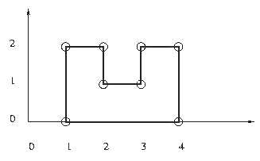
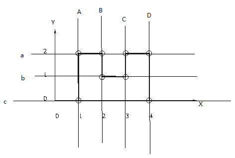
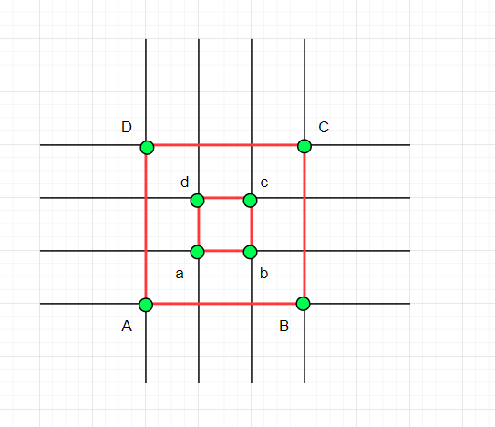
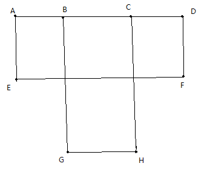

[Poj 3293 Rectilinear Polygon 扫描线](https://yfscfs.gitee.io/post/poj-3293-rectilinear-polygon-%E6%89%AB%E6%8F%8F%E7%BA%BF/)

[代码参考](https://www.cnblogs.com/ZefengYao/p/7470984.html)

### POJ-3293(直角多边形)



**题意:**
- 给定N个点，问是否能组成直角多边形
- 每个顶点都与另外两个顶点构成直角
- 每条边都平行于坐标轴，而且该直角多边形没有洞
- 并求出周长？

### 思路
对于任何一个方向的扫描线，这个扫描线上的顶点的个数需要是偶数, 如果是奇数的话，直接返回 -1, 一定构不成直角多边形的. 什么意思呢?


你看，Y方向的扫描线有 A、B、C、D 四条，而 X方向的扫描线有 a、b、c 三条. 这7条扫描线上每一条上面的顶点个数都是偶数个. 例如 a 上有 4个顶点. C 上有 2个顶点.

如果是奇数个的话，则一定构不成直角多边形，则返回 -1. 如果是偶数的话，一定是扫描线上相邻的两个点进行配对. 则就可以一边扫描一边维护周长了.

但是这样就够了吗? 如果有洞的情况呢? 例如下图:


上面的图形是"回” 字，是有洞的~ 上面的算法仅仅检测扫描线上顶点的个数的奇偶性的话，是无法排除这种带洞的情况的.

带洞的情况其实十分好搞的——判断最后是否连通就行了. 而判断连通使用并查集即可. 但是还有一个问题. 就是连线出现交叉的情况. 就像下图 8 个点.

最后 8 个点都是连通的, 而且每条扫描线上都是偶数个点. 但是依旧要返回 -1. 因为出现了 BG 和 EF 相交的情况. 那么怎么判断相交呢? 暴力。

```js
/**
 * POJ-3293(直角多边形)
 */


let link_x = []
let link_y = []


class Line {
  constructor(p1, p2) {
    this.p1 = p1
    this.p2 = p2
  }
}

function get(point, is_x) {
  if (is_x) {
    return point.x
  } else {
    return point.y
  }
}

function judge_intersect(a, info) {
  let y = a.p1.y;
  let x1 = a.p1.x
  let x2 = a.p2.x;

  for (let i = 0; i < info.amount; i++) {
    if (
      y > info.ls[i].p1.y &&
      y < info.ls[i].p2.y &&
      x1 < info.ls[i].p1.x &&
      x2 > info.ls[i].p2.x
    ) {
      return true;
    }
  }
  return false;
}

function link(a, b, is_x) {
  if (is_x) {
    link_x[a.tttId] = b.tttId;
    link_x[b.tttId] = a.tttId
  } else {
    link_y[a.tttId] = b.tttId
    link_y[b.tttId] = a.tttId
  }
}

let is_x = true

function cmp(a, b) {
  let ax = get(a, is_x)
  let ay = get(a, !is_x)
  let bx = get(b, is_x)
  let by = get(b, !is_x)


  if (Math.abs(ax - bx) > 0.2) {
    return ax - bx
  } else {
    return ay - by
  }
}

function traverse(points, info, is_x) {
  points.sort(cmp)
  let count_same_line = 1;
  let sum = 0
  for (let i = 1; i < points.length; i++) {
    let d1 = get(points[i], is_x)
    let d2 = get(points[i - 1], is_x)
    if (Math.abs(d1 - d2) > 0.2) {
      //偶数扫描线移动
      if (count_same_line % 2 != 0) {
        return -1;
      }
      count_same_line = 1;
    } else {
      // 同一条扫描线上的点遍历
      ++count_same_line;
      if (!(count_same_line & 1)) {
        let t1 = get(points[i], !is_x)
        let t2 = get(points[i - 1], !is_x)
        sum += t1 - t2
        link(points[i], points[i - 1], is_x)
        if (is_x) {
          // 横向扫描记录竖向直线
          info.ls[info.amount++] = new Line(points[i - 1], points[i]);
        }
        else {
          // 竖向扫描检查是否相交
          if (judge_intersect(new Line(points[i - 1], points[i]), info)) {
            return -1;
          }
        }
      }
    }
  }
  return sum;
}

/**
 *
 * @param {*} points
 * @note 代码参考: https://www.cnblogs.com/ZefengYao/p/7470984.html
 */
export function rectilinearPolygon(points) {
  const n = points.length
  points.forEach((item, index) => {
    item.tttId = index
  });

  // 记录连边的个数
  let info = {
    amount: 0,
    ls: {}
  }

  let isX = true
  is_x = isX
  let num_x = traverse(points, info, isX);
  if (num_x == -1) return -1;

  isX = false
  is_x = isX
  let num_y = traverse(points, info, isX);
  if (num_y == -1) return -1;

  let loop = 0;
  let count = 0;

  do {//判断不联通的图
    loop = is_x ? link_x[loop] : link_y[loop];
    count++;
    is_x = !is_x;
  } while (loop != 0);

  if (count != n) return -1;
  return num_x + num_y;
}

```
